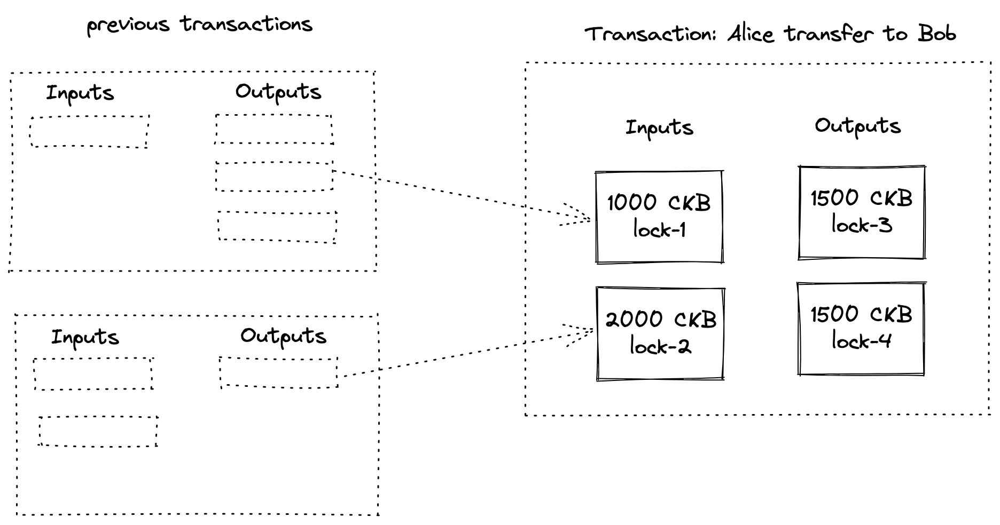

# Background

There are already several wallets in the CKB ecosystem, such as Neuron, Portal Wallet, ckb-cli, etc. Although they are
all called wallet, users can choose the wallet that is suitable for their requirements according to different scenarios.

So now that there are already so many wallet products in the ecosystem, is there anything missing? Let's take a brief
look at the features of these wallets

| Wallet \ Feature | Interoperability | Web | UTxO | GUI | Operability |
|----------------------------------------|------------------|-----|------|-----|-------------|
| CKB-CLI                                | ✅                |     | ✅    |     | ✅           |
| Neuron                                 |                  |     | ✅    | ✅   | ✅           |
| MetaMask                               | ✅                | ✅   |      |     |             |
| UniPass                                | ✅                | ✅   |      | ✅   |             |
| Portal Wallet                          |                  | ✅   |      | ✅   | ✅           |

| Feature          | Description                                                                                                   |
|------------------|---------------------------------------------------------------------------------------------------------------|
| Interoperability | Provides APIs that dApps can interact with, allowing dApps to help users manage the contents of their wallets |
| Web              | Runs in web                                                                                                   |
| UTxO             | Support for managing key pairs in the UTxO model for privacy benefits                                         |
| GUI              | Interface for the end user                                                                                    |
| Operability      | Direct operation of assets in the wallet, such as transfers                                                   |

If we want to enrich the dApp ecosystem, the two most important features for wallets are interoperability and the
ability to run in web.

MetaMask plays a very important part in the dApp ecosystem because MetaMask runs in web and MetaMask provides an
easy-to-use API for dApps. If you have used dApps on CKB layer 1, such as Portal Wallet, .bit or some asset bridges, you
will find that MetaMask is called when sending a transaction.

However, MetaMask is a wallet designed based on the account model and it works well with the account model, but CKB is
using the UTxO model. While it is possible that we can simulate the account model in UTxO, this would make it difficult
to exploit the advantages of the UTxO model.

> The UTxO model offers privacy benefits to users. Users can handle each UTxO separately by storing each UTxO in a
> unique address. By using a unique address to receive each UTxO, users can hide the connection between their UTxOs from
> public knowledge. To an observer of the blockchain, it is difficult to ascertain which UTxOs belong to which users.

We realized that we seem to be missing a wallet for dApps on CKB layer 1, which should be UTxO-friendly, while it can
run in web and it is interactable
