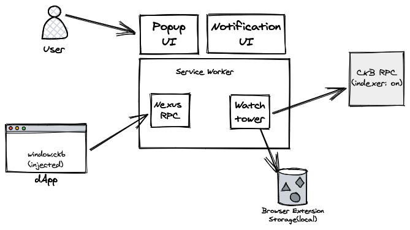

# Architecture

## Injected CKB

A `ckb` object is injected into the global scope of the web page if Nexus is installed. It provides a set of APIs for
the dApp to interact with the Nexus extension.

## Nexus JSON-RPC

Nexus provides a JSON-RPC interface for the dApp to interact with the Nexus extension. The dApp can use the `ckb`
object to send JSON-RPC requests to the Nexus extension.

## Popup UI and Notification UI

The Nexus extension provides a popup UI for configuration and a notification UI for notification when dApp requests
to access the Nexus extension or when the dApp requests to sign a transaction.

## Watchtower

The watchtower is a service that watches the blockchain and updates the state of derived locks.

## Storage

Nexus uses `chrome.storage.local` to store the state of the Nexus, including the configuration, the state of derived locks, etc.
