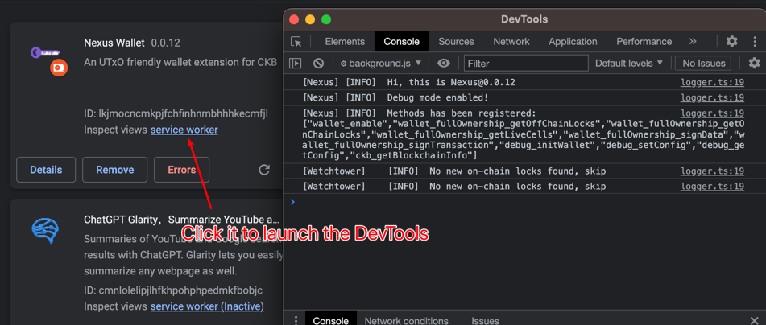

# Development

## Skip Setup

If you are starting with `npm start` the development environment will be setup for you. To skip the wallet setup, you
can use the `debug_*` methods to speed up the process.

```js
// wallet will be setup with
// {
//    "nickname": "Nexus Dev",
//    "mnemonic": "abandon abandon abandon abandon abandon abandon abandon abandon abandon abandon abandon about",
//    "password": "12345678"
// }
await window.ckb.request({ method: 'debug_initWallet' });
```

## Logs

To log messages in the console, we can use the `logger` in `@nexus-wallet/utils`.



## Debugging

When development mode is enabled(`process.env.NODE_ENV === 'development'`), the following features are enabled:

### `_nexusModuleFacotry`

A `_nexusModuleFactory` property is injected in global scope, which can be used to factory a module. This is useful for
debugging the module factory.

```js
let hub = globalThis._nexusModuleFactory.get('eventHub');
hub.emit('networkChanged', 'network-id');
```

## Dumping State

To dump the state of the extension, we should first open the background page of the extension `chrome://extensions/`,

```js
JSON.stringify(await chrome.storage.local.get());
```
