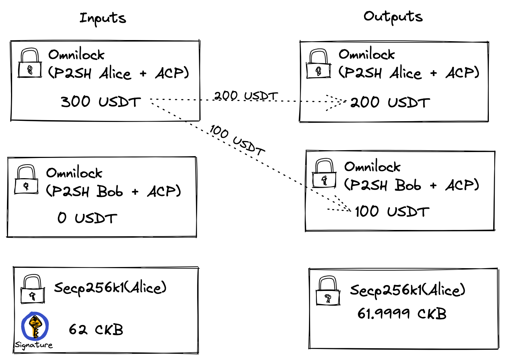

# Works with Anyone-Can-Pay Like Case

Anyone-Can-Pay(also known as ACP) wast first proposed as a [lock](https://github.com/nervosnetwork/rfcs/blob/master/rfcs/0026-anyone-can-pay/0026-anyone-can-pay.md), and as the community grew, the ACP gradually became a feature or a mode, there are many locks that support the features of ACP, e.g. [PW lock](https://github.com/lay2dev/pw-lock/blob/master/c/secp256k1_keccak256_sighash_all_acpl.c#L1-L13), [UniPass](https://unipass.id/), and [Omnilock](https://github.com/nervosnetwork/rfcs/blob/master/rfcs/0042-omnilock/0042-omnilock.md#anyone-can-pay-mode).

Here we focus on Omnilock, unlike other locks, Omnilock providers ACP feature as a flag, which means that the user can choose whether or not to enable the ACP feature, and Omnilock's ownership is also optional, Omnilock provides the [P2SH](https://github.com/nervosnetwork/rfcs/blob/master/rfcs/0042-omnilock/0042-omnilock.md#authentication) authentication mode.

  

