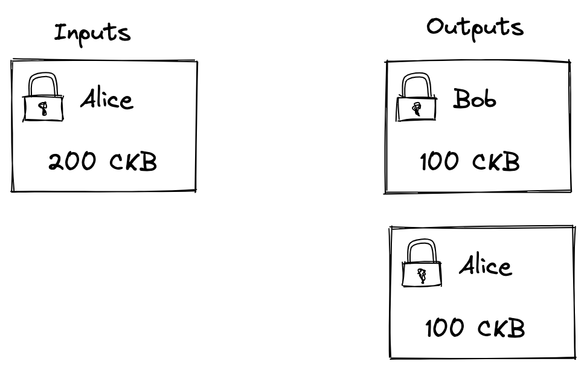
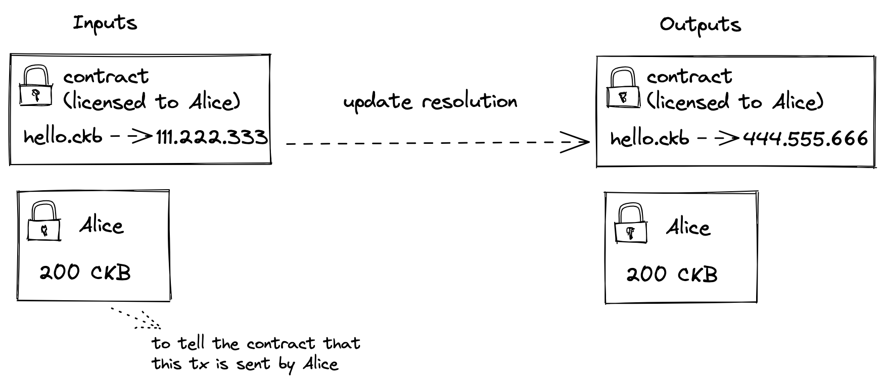
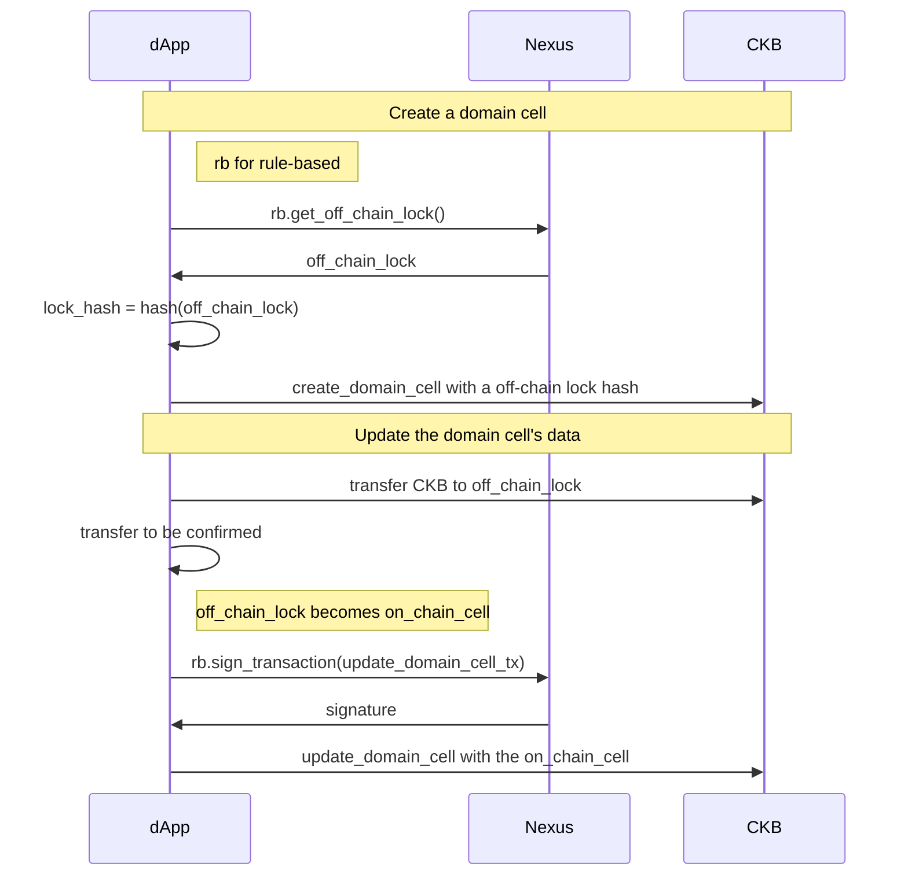

# Design

## User Stories

1. CKB payment
   1. transfer CKB to others
   2. as capacity of a new cell created in a transaction
   3. pay transaction fees
2. Where to store cells
   1. store all collected NFTs
   2. store all sUDTs(a ERC-20 like token)
3. Signing a transaction
4. Signing off-chain custom messages
   1. login to a website via a public key
   2. sign a part of transaction like Open Transaction
   3. P2P atomic swap, like [this example from Cardano](https://atomic-swap.io/home) or [this example from Ckit](https://github.com/ckb-js/ckit/issues/108)

These user stories described above are all related to ownership, actually, it is often mentioned

> "Not Your Keys, Not Your Coins"

Since the key is the key, let's start with key management

## Key Derivation

### Full Ownership

UTxO wallets in the CKB ecosystem already use [BIP-44](https://github.com/bitcoin/bips/blob/master/bip-0044.mediawiki) as a derivation path, such as [Neuron](https://github.com/nervosnetwork/neuron/blob/b0aa8bfb9c87c625c08609b85a1cf7629e7093ee/packages/neuron-wallet/src/models/keys/key.ts#L53), so Nexus can keep using this BIP-44 derivation rule and [secp256k1_blake160](https://github.com/nervosnetwork/ckb-system-scripts/blob/master/c/secp256k1_blake160_sighash_all.c) lock to manage the most common, fully owned cell.

```
m / 44' / 309' / 0' / change / index
```

<p align="center">
  
</p>

The fully owned cell means that the unlock rule of a cell can only be done by signing with a private key, which typically means the cell owned by a single user, such as sUDT or NFT asset cell.

### Rule-Based Ownership

In some cases, there are additional rules for cell ownership, such as domain names, which are usually represented in the blockchain as an NFT, but this NFT usually have an expiration date for the holder, and will be recalled after the expiration date. In this NFT case, the NFT cell cannot use the holder's `secp256k1_blake160` lock as the NFT's lock, instead, it uses holders lock for [P2SH](https://github.com/bitcoin/bips/blob/master/bip-0016.mediawiki)

The P2SH transaction in CKB looks like this

<p align="center">
  
</p>

Unlike full ownership, rule-based ownership tends to exist on-chain as script hash, and because of the flexibility of CKB scripts, script hash does not exist as a fixed `OP_HASH160 [20-byte-hash-value] OP_EQUAL`, but appears on-chain dynamically in various scripts with business logic. As a result, it is difficult for wallets to probe rule-based locks that have already been used.

```
m / ckb_purpose 1' / account' / index
```

Check out the [ckb_purpose](./purpose-field.md) for more details about the purpose field.

Rule-based locks do not usually exist on the chain immediately when they are used, We use the domain cell as an example



## JavaScript Provider

```ts
interface InjectedCkb {
  /**
   * Enable the wallet for a dApp
   */
  enable(): Promise<CkbProvider>;

  /**
   * Check the wallet is enabled for the dApp
   */
  isEnabled(): Promise<boolean>;

  /**
   * Get the version of the injected CKB
   */
  version: string;
}

interface CkbProvider {
  /**
   * Get the connected network
   *
   */
  getNetworkName(): Promise<Network>;

  fullOwnership: Ownership;
  ruleBasedOwnership: Ownership;
}

interface FullOwnership {
  getOffChainLocks(options?: GetOffChainLocksOptions): Promise<Script[]>;

  getOnChainLockss(payload?: { cursor?: string }): Promise<Paginate<Script>>;

  getLiveCells(payload?: { cursor?: string }): Promise<Paginate<Cell>>;

  signTransaction(payload: { tx: Transaction }): Promise<GroupedSignature>;

  /**
   * sign custom message
   */
  signData(payload: SignDataPayload): Promise<Signature>;
}

interface WalletEventListener {
  on(event: 'networkChanged', cb: (payload: { network: Network }) => void): void;
}

/**
 * @see https://github.com/nervosnetwork/ckb/blob/develop/rpc/README.md#type-chaininfo
 */
type Network = 'ckb' | 'ckb_testnet';

type GetOffChainLocksOptions = {
  // will be ignored in rule-based ownership
  change?: boolean;
};

interface Paginate<T> {
  objects: T[];
  cursor: string;
}

type GroupedSignature = [Script, Signature][];
type Signature = string;

type SignDataPayload = {
  data: BytesLike;
  signer: LockLike;
};

type LockLike = PubkeyHash160 | Script;
type PubkeyHash160 = BytesLike;
```

## Additional Info

### Should Nexus Support for Other Lock?

Open Transaction and Multisig(via Omnilock) support will be considered, but support for other locks is unlikely. In the short term, P2PKH and P2SH seem to be able to cover the user stories we mentioned.

### Should Nexus Support for Other Signature Algorithm?

SHOULD NOT. The case for custom signature algorithms is that CKB can use other blockchain wallets as CKB's signer.

Nexus is not another blockchain wallet, but a CKB-specific wallet, so there is no reason to support other signature algorithms.

Some wallets may be able to signing with the TEE and auth by biometric authentication technology, but we don't think this is the purpose of Nexus, so we're not considering it yet either

### Is There a Problem with BIP-44 as with Neuron?

Users may use their seeds in both Neuron and Nexus, but this is not a problem, Neuron will only consume cells with [empty](https://github.com/nervosnetwork/neuron/blob/master/packages/neuron-wallet/src/services/cells.ts#L432-L462) data and type when transferring. But this brings up another thought, the dApp may have a bug that causes the user's cell to be consumed incorrectly. So far we have considered using UI/UX to let the user double-check the content when signing.

### Can You Talk About the Disadvantages of the Design?

We mentioned the privacy benefits of UTxO before, but this design exposes some of that privacy to the dApp. If the dApp requests the user's lock from Nexus multiple times, then the dApp can actually know that the addresses belong to a particular user. Nexus can promise never to collect any user data for analysis, but Nexus can't guarantee that dApp won't do this.

### More

- [Works with Anyone-Can-Pay Like Case](./design-anyone-can-pay.md)
- [Prototype](https://www.figma.com/file/6il5bkgZDrfJhCBs2c7er4/Nexus-Wallet)
