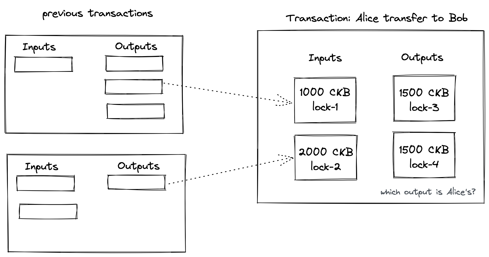
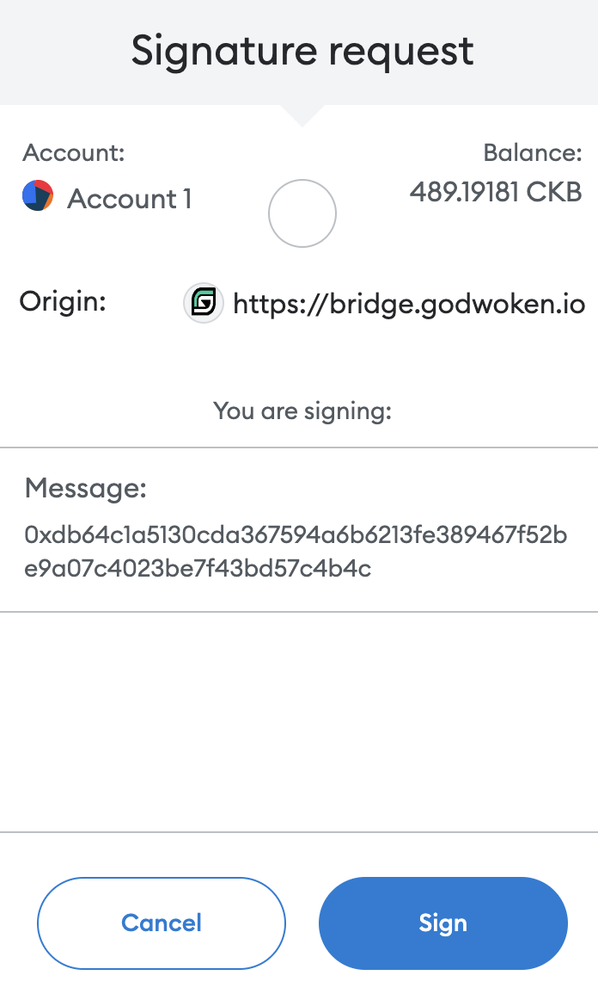
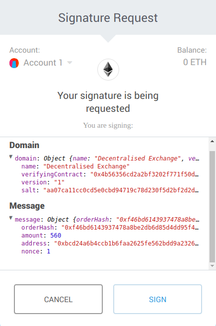
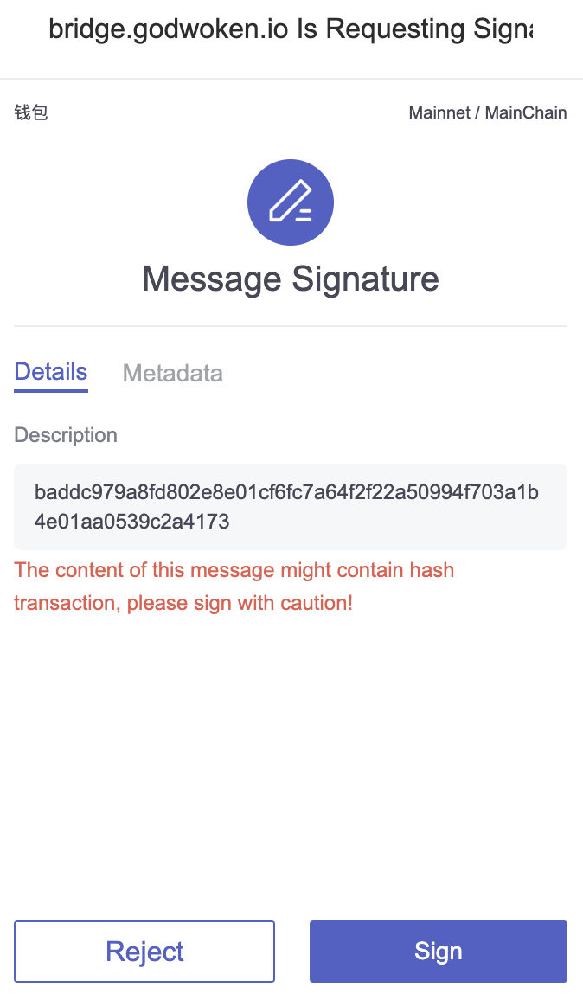
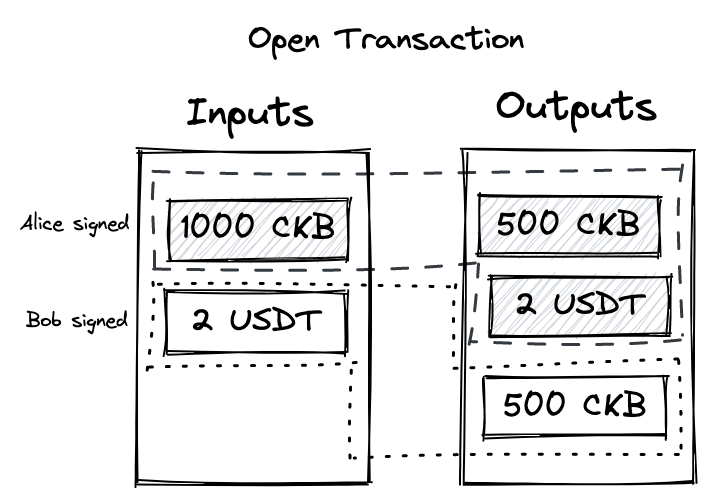
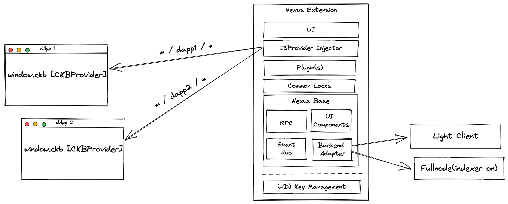
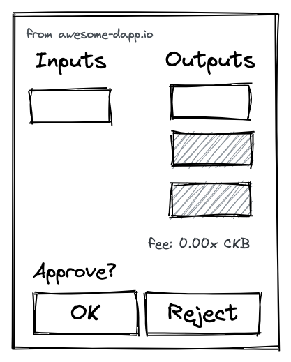
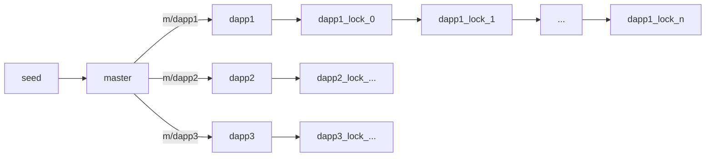
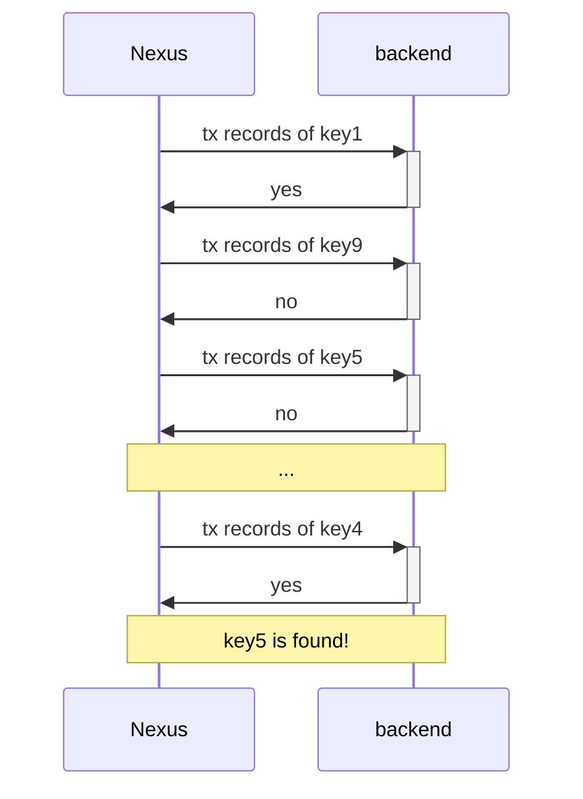

# Proposal for Nexus - An UTxO-Friendly Wallet Extension for CKB

## TL;DR

Most dApps run in a browser, and for security reasons, users use wallets to manage their keys, rather than exposing them directly to the dApp. To send a transaction, the key needs to be used to sign it, so a wallet for a dApp will usually provide APIs for the dApp to communicate with the wallet, and for the user to confirm whether to perform the action. So if we want to enrich the dApp ecosystem, the two most important features for wallets are interoperability and the ability to run in web.

We realized that there seems to be missing a wallet for dApps on CKB layer 1, which should be UTxO-friendly, while it can run in web, and it is interactable.

## Background

There are already several wallets in the CKB ecosystem, such as [Neuron](https://github.com/nervosnetwork/neuron), [Portal Wallet](https://ckb.pw), [CKB CLI](https://github.com/nervosnetwork/ckb-cli), etc. Although they are all called wallet, users can choose the wallet that is suitable for their requirements according to different purposes.

So now that there are already so many wallet products in the ecosystem, is there anything missing? Let's take a brief look at the features of these wallets

| <sub>Wallet</sub> \ <sup>Feature</sup> | Interoperability | Web | UTxO | GUI | Operability |
| -------------------------------------- | ---------------- | --- | ---- | --- | ----------- |
| CKB-CLI                                | ✅               |     | ✅   |     | ✅          |
| Neuron                                 |                  |     | ✅   | ✅  | ✅          |
| MetaMask                               | ✅               | ✅  |      |     |             |
| UniPass                                | ✅               | ✅  |      | ✅  |             |
| Portal Wallet                          |                  | ✅  |      | ✅  | ✅          |

| Feature          | Description                                                                                                   |
| ---------------- | ------------------------------------------------------------------------------------------------------------- |
| Interoperability | Provides APIs that dApps can interact with, allowing dApps to help users manage the contents of their wallets |
| Web              | Runs in web                                                                                                   |
| UTxO             | Support for managing key pairs in the UTxO model for privacy benefits                                         |
| GUI              | Interface for the end user                                                                                    |
| Operability      | Direct operation of assets in the wallet, such as transfers                                                   |

### MetaMask & CKB dApp

MetaMask plays a very important part in the dApp ecosystem because MetaMask runs in web and MetaMask provides an easy-to-use API for dApps. If you have used dApps on CKB layer 1, such as Portal Wallet, .bit or some asset bridges, you will find that MetaMask is called when sending a transaction.

### Hard to UTxO

However, MetaMask is a wallet designed based on the account model and it works well with the account model, but CKB is using the UTxO model. While it is possible that we can simulate the account model in UTxO, this would make it difficult to exploit the advantages of the UTxO model.



> The UTxO model offers privacy benefits to users. Users can handle each UTxO separately by storing each UTxO in a unique address. By using a unique address to receive each UTxO, users can hide the connection between their UTxOs from public knowledge. To an observer of the blockchain, it is difficult to ascertain which UTxOs belong to which users.

### Hard to Understand

Wait, CKB is not an EVM-based blockchain, why can CKB use MetaMask to sign transaction?

CKB implements cryptographic primitives as ordinary assembly running on CKB VM, instead of customized instructions. dApp can use MetaMask as a signer for CKB by implementing [EIP-191](https://eips.ethereum.org/EIPS/eip-191) or [EIP-712](https://eips.ethereum.org/EIPS/eip-712) in the contract.

Moreover, wallets of other chains can also act as a signer of CKB if the dApp wants to, such as [Cardano](https://codesandbox.io/s/github/ckb-js/lumos/tree/develop/examples/cardano-lock-namiwallet), Tron etc.

However, for dApp users, signing CKB transactions using these extended signing methods is hard to understand

|                     EIP-191                      |                     EIP-712                      |                      Tron                      |
| :----------------------------------------------: | :----------------------------------------------: | :--------------------------------------------: |
|  |  |  |

### Hard to Extend

The possibilities offered by CKB are not only limited to "using other chain's wallets as CKB signers".

CKB's contracts even allow different participants to sign different parts of the transaction separately. CKB recently developed [Open Transaction](https://github.com/nervosnetwork/ckb/issues/3608) is one such solution.



While this is a very cool feature, it will be hard for users to enjoy it if it is not supported on the wallet.

## Nexus

Therefore, we want to build Nexus, a wallet extension allows users to experience a more complete CKB.

This wallet should

- be able to run in a browser
- exposes APIs for dApps to interact with
- UTxO-friendly

### Browser Extension

Besides the website, extensions are also able to run in a browser.

dApps usually need to sign a transaction, and a key is required for signing. For security reasons, wallet must ensure the isolation between the user's key and dApps, but at the same time wallet needs to have a way for dApps to sign the transaction

Extension can achieve all this with a low barrier, extension not only is able to communicate with website, but also has a UI that allows dApp users to understand the behavior of dApps, so Nexus chose to base its development on the platform provided by browser extension



### JavaScript Provider

In order to allow dApps interact with Nexus in JavaScript, Nexus could inject a `ckb` object into the `globalThis` of dApps', which encapsules the communication methods as JSON RPCs, making it easy to communicate between Nexus and dApps

```js
// Request Permission
await ckb.request('wallet_enableNamespace', {
  namespace: 'awesome-dapp',
  // lockType: 'omnilock-secp256k1',
})

// Query & Assemble
await ckb.request('wallet_collectLiveCells', ...);
await ckb.request('wallet_getUnusedLock', ...);

// Signing
await ckb.request('wallet_signSigHashAll', ...);
```

### Ergonomics

There are some communications that needs to be confirmed by the dApp user, such as signing a transaction, requesting permission, etc., and that's where the UI comes in handy. Nexus can shows the current request behavior of the dApp through a popup, allowing user to confirm whether to alow the curren behavior.



### UTxO

We mentioned above that UTxO is hard to trace and hence protects the privacy of users. To make transactions hard to trace, the dApp can make each transaction use a different address, which in CKB can also be described as lock.

Almost every dApp has its own cell structure, for example, Godwoken Bridge has its own deposit cell, withdrawal cell, and Force Bridge has bridge cell, etc. The structure of these cells are different, and even the lock used between dApps can be different, so dApps need to be isolated from each other.

[BIP-32](https://github.com/bitcoin/bips/blob/master/bip-0032.mediawiki) allows us to derive a large number of child keys from a seed, which makes it very convenient to use a new address for every transaction. In addition, BIP-32 is able to derive keys in a hierarchical approach, which is a great help to keep the use of keys isolated between dApps



### Backend

In order to provide unused lock to the dApp as much as possible, extension can cache the most recently used BIP-32 path, but what if the user is using the seed on more than one device? Or if the user imports a seed that has been used before, how dees Nexus provide unused locks for dApps? Well, Nexus also needs a recovery mechanism to retrieve the usage history of the seed.



CKB currently has two types of clients, [Fullnode](https://github.com/nervosnetwork/ckb) and [Light CLient](https://github.com/nervosnetwork/ckb-light-client). Fullnode is suitable as a public service since it requires more resources, while Light Client is suitable for self-host, Nexus can design the backend as an adapter to support these two clients

### Plugin System

// TODO

- Introduce Nexus Base
- Introduce [Module Federation](https://module-federation.github.io/)
- Nexus Base + Module Federation to bring plugin system for Nexus

---

We believe that Nexus can bring more possibilities for CKB dApp development, and Nexus will be the nexus between CKB, dApp, and users.
