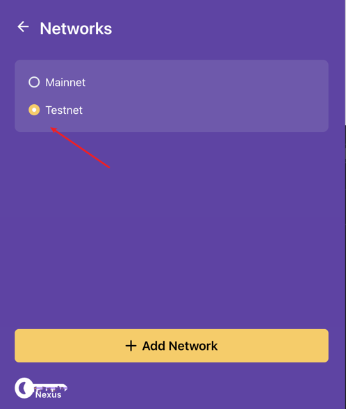
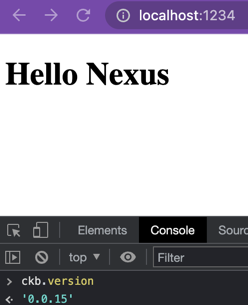
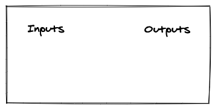
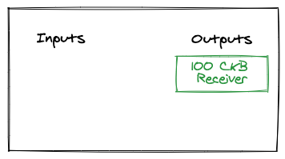
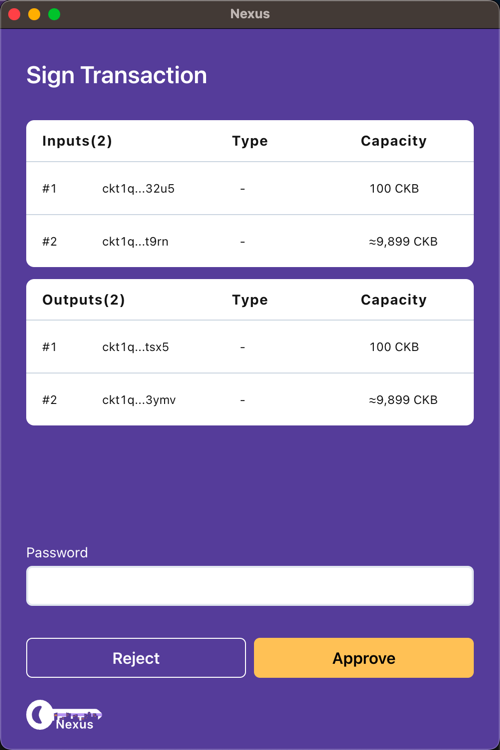
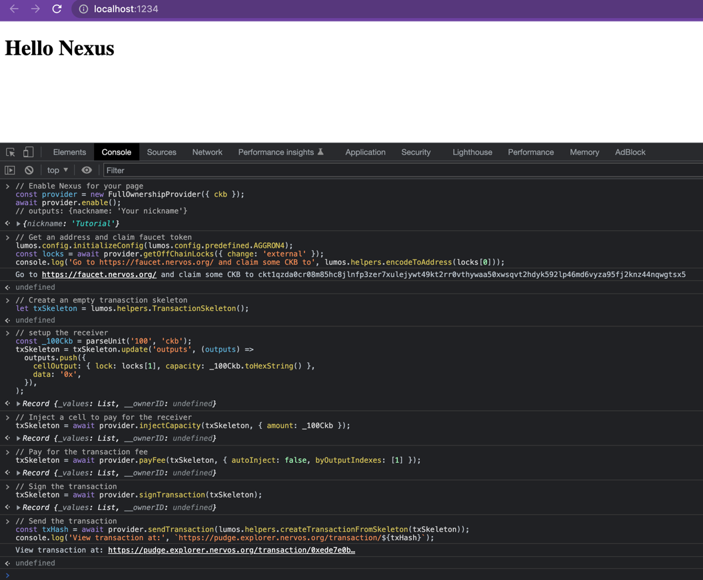

# Tutorial

We'll build a simple example to demonstrate how to use Nexus and an SDK called `FullOwnershipProvider` to build a
transaction.

## Setup

We'll start by installing the dependencies. Since Nexus is a Chrome extension, the example needs to run in Chrome.

To simplify the example, we'll use [Parcel](https://parceljs.org/) to compile and bundle TypeScript code, and output the
result to the Console, so we won't need to write any UI code.

### Install Dependencies

```sh
npm init -y
npm install @nexus-wallet/ownership-providers \
  @nexus-wallet/detect-ckb \
  @ckb-lumos/lumos@0.20.0-alpha.2 \
  @ckb-lumos/codec@0.20.0-alpha.2 \
  buffer \
  parcel
```

### Create Files

Parcel will only need an `index.html` file as an entry point, and inject some dependencies into the page,
so we'll create one and add the following code.

```html
<!DOCTYPE html>
<html lang="en">
  <head>
    <title>Hello Nexus</title>
    <script type="module">
      import * as lumos from '@ckb-lumos/lumos';
      import { FullOwnershipProvider } from '@nexus-wallet/ownership-providers';
      import { parseUnit } from '@ckb-lumos/bi';

      Object.assign(window, { lumos, FullOwnershipProvider, parseUnit });
    </script>
  </head>
  <body>
    <h1>Hello Nexus</h1>
  </body>
</html>
```

### Start Parcel

Then we can launch Parcel and open a console at `http://localhost:1234` to start coding.

```
npx parcel index.html
```

## The Example

> Please make sure you have [installed](user-guide.md) and initialized Nexus, and connected to CKB testnet.




### Step 1 - Enable Nexus For Your Page

To access Nexus, a DApp must first request permission from Nexus, which is called enable. After the access is granted,
the DApp can access addresses and other information of the Nexus. A DApp only needs to enable once.

```js
// Enable Nexus for your page
const provider = new FullOwnershipProvider({ ckb });
await provider.enable();
// outputs: {nackname: 'Your nickname'}
```

### Step 2 - Get An Address And Claim Faucet Token

We'll claim some CKB from [Nervos Testnet Faucet](https://faucet.nervos.org/) to Nexus, so we need an address, which is
a string like `ckt1qzda0...qwgtsx5`. In Nervos CKB, an address is encoded from
a [lock script](https://docs.nervos.org/docs/basics/glossary/#lock-script).

```js
// Get an address and claim faucet token
lumos.config.initializeConfig(lumos.config.predefined.AGGRON4);
const locks = await provider.getOffChainLocks({ change: 'external' });
console.log('Go to https://faucet.nervos.org/ and claim some CKB to', lumos.helpers.encodeToAddress(locks[0]));
```

### Step 3 - Create An Empty Transaction Skeleton

```js
// Create an empty tranasction skeleton
let txSkeleton = lumos.helpers.TransactionSkeleton();
```



### Step 4 - Set Up The Receiver

We'll create a 100 CKB cell as the receiver, and for the sake of demonstration, we'll use another lock script derived
from
Nexus as the receiver's lock script.

```js
// setup the receiver
const _100Ckb = parseUnit('100', 'ckb');
txSkeleton = txSkeleton.update('outputs', (outputs) =>
  outputs.push({
    cellOutput: { lock: locks[1], capacity: _100Ckb.toHexString() },
    data: '0x',
  }),
);
```



### Step 5 - Inject A Cell To Pay For The Receiver

```js
// Inject a cell to pay for the receiver
txSkeleton = await provider.injectCapacity(txSkeleton, { amount: _100Ckb });
```


### Step 6 - Pay For The Transaction Fee

We'll pay for the transaction fee by using the cell we just injected, so we need to set `autoInject` to `false` and
specify the output index of the cell we want to pay for the fee, i.e. `outputs[1]`, the second output

```js
// Pay for the transaction fee
txSkeleton = await provider.payFee(txSkeleton, {
  autoInject: false,
  // outputs[1], the second output, which is the cell we just injected
  byOutputIndexes: [1],
});
```


### Step 7 - Sign The Transaction

If all goes well, Nexus will ask you to sign the transaction. Input your password and click `Approve` to sign the
transaction.



```js
// Sign the transaction
txSkeleton = await provider.signTransaction(txSkeleton);
```

### Step 8 - Send(Broadcast) The Transaction

Then we can broadcast the transaction and view it on the explorer.

```js
// Send the transaction
const txHash = await provider.sendTransaction(txSkeleton);
console.log('View transaction at:', `https://pudge.explorer.nervos.org/transaction/${txHash}`);
```

## Summary

In this tutorial, we've learned how to use Nexus to build a transaction via an SDK called `FullOwnershipProvider`. If
all goes well, you should see a transaction on the explorer.


