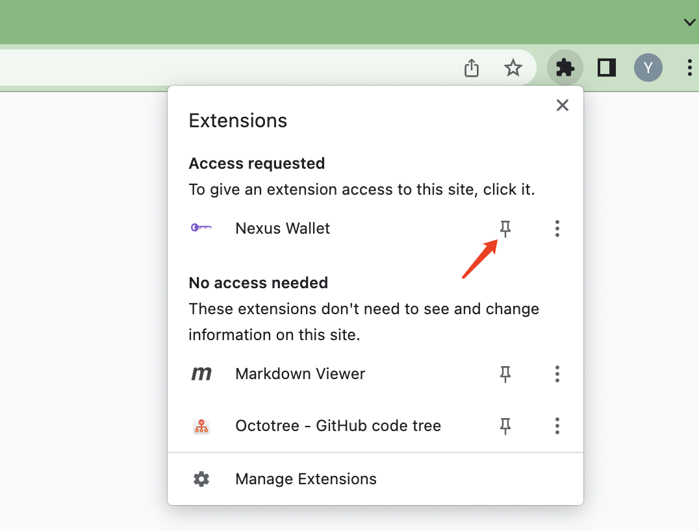
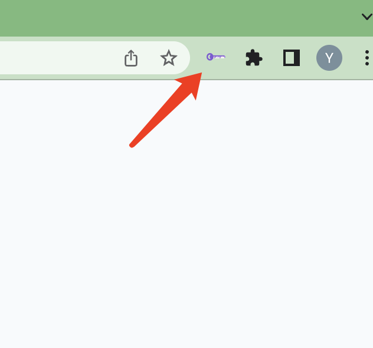
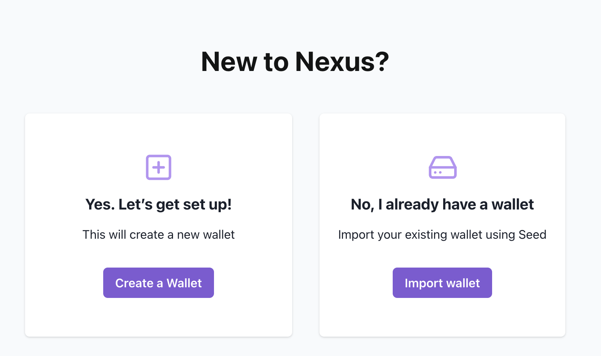
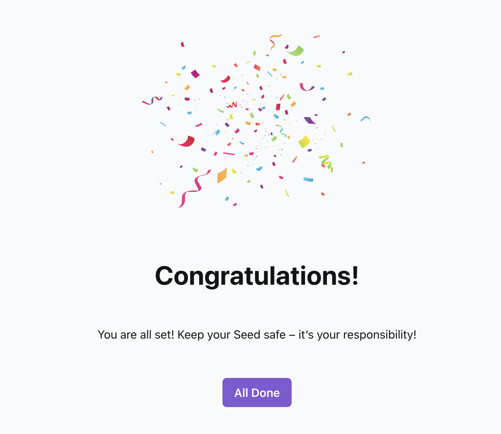
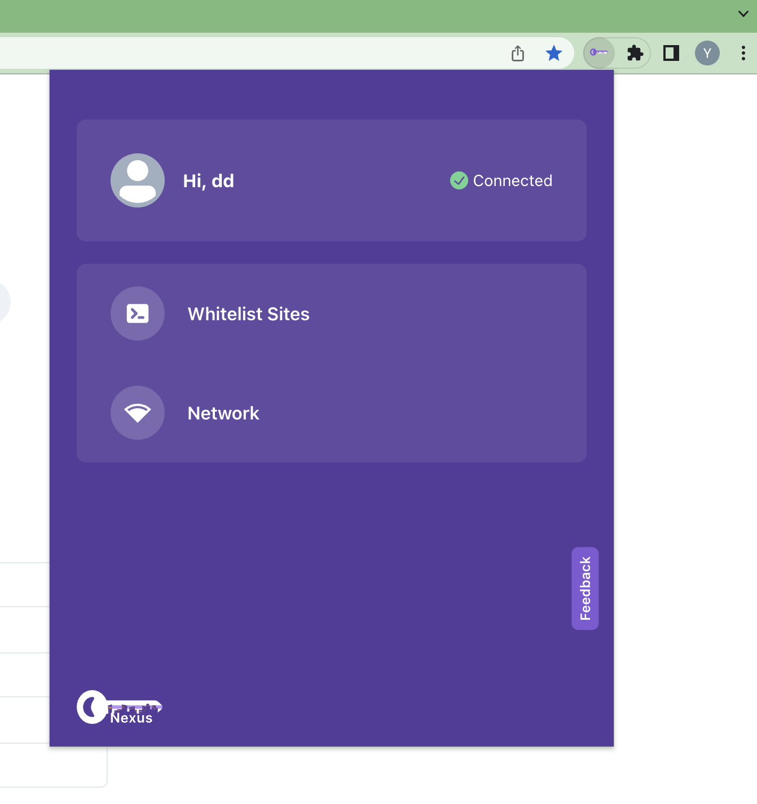
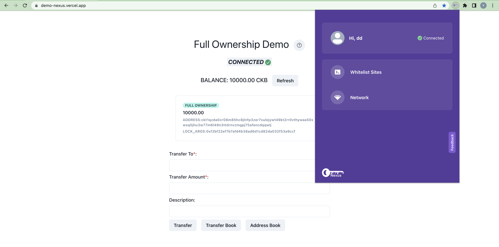

# Introduction

Nexus Wallet is a Chrome extension that end users can use to connect to DApps and sign transactions or messages. By default, it supports CKB mainnet and testnet, you can also add custom networks.

## Installation

Following the [Nexus readme](../README.md), you can clone the repo and build the Nexus Wallet, then install the Nexus extension on Chrome by the instructions [here](https://developer.chrome.com/docs/extensions/mv3/getstarted/development-basics/).

## Initialize the Nexus Wallet

After installing the Nexus extension, you can open the Nexus Wallet and initialize the Nexus Wallet.

Firstly, you can pin the Nexus Wallet to the Chrome taskbar by clicking the pin icon on the top right corner of the browser.

Then you can open the Nexus Wallet initialization page by clicking the Nexus icon on the Chrome taskbar.

By clicking the Nexus icon, you will be navigated to the Nexus Wallet welcome page.

Then you have a set of mnemonics, click `Import Wallet` button, otherwise, click the `Create a Wallet` button. Follow the instructions on the page to initialize the Nexus Wallet, when you see the page below, now you are all set.

> Nexus is compatible with [Neuron](https://github.com/nervosnetwork/neuron), If you are a Neuron user, try import Neuron's menmonics into Nexus.

## Try it out

What you can do next is to go to your favorite dApp and try it out. Or click the Nexus icon on the Chrome taskbar to open the Nexus Wallet and view your profile.

A [Dapp Demo](https://demo-nexus.vercel.app/) which supports Nexus is also available.

