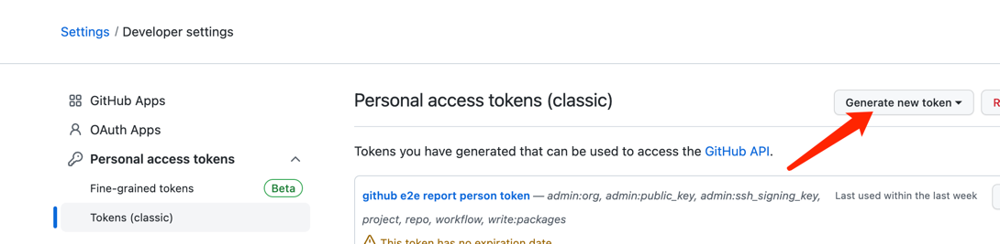
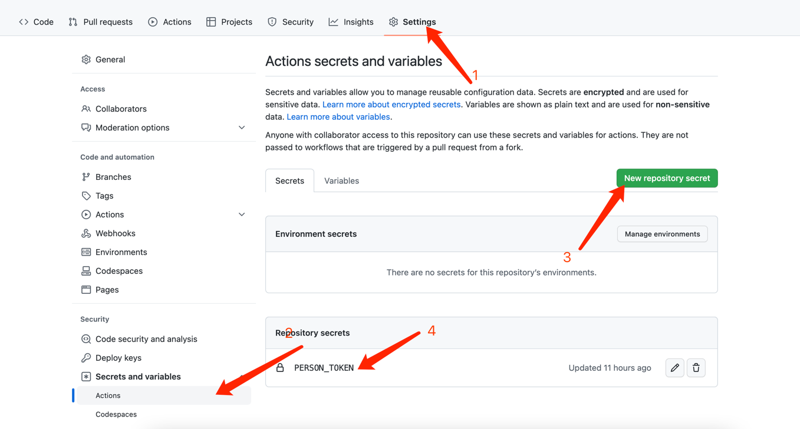
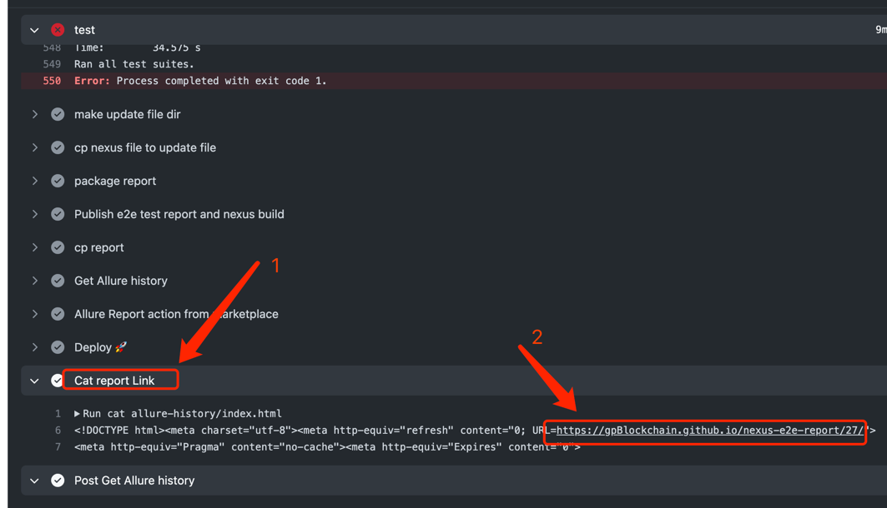
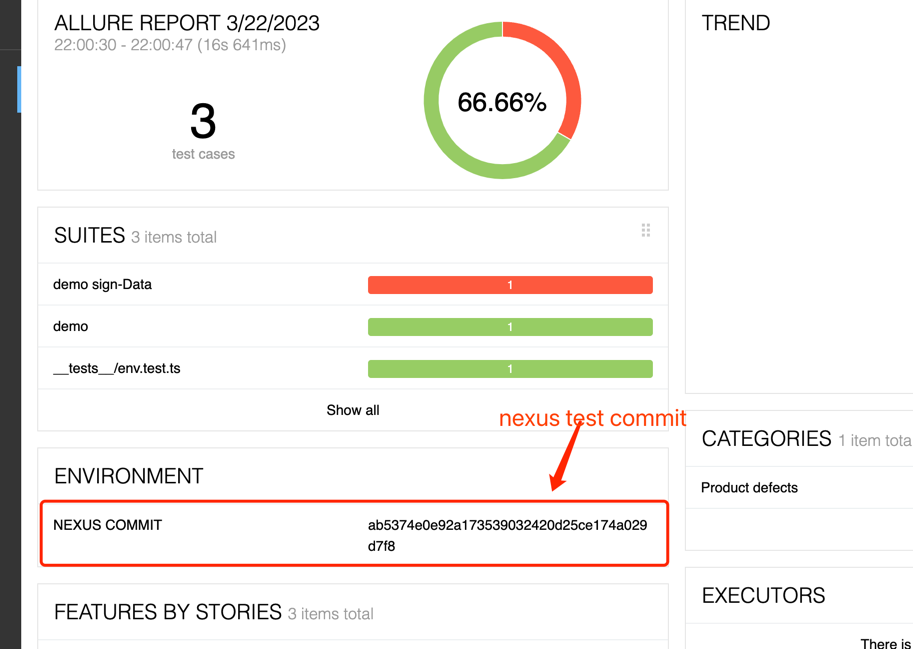
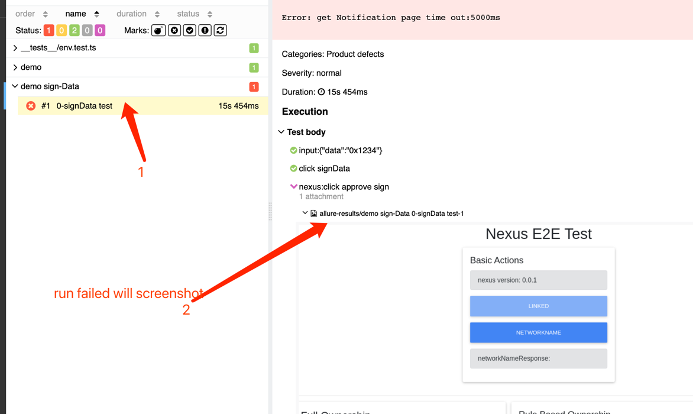

# e2e

E2E testing for dApps using playwright + Nexus

## Usage

open `nexus` extension page, connect web with `nexus`

```javascript
const nexusExtensionPath = './build';
const browser = await launchWithNexus({ nexusPath: nexusExtensionPath });
const nexusWallet = await setUpNexus(browser, { mock: true });
const page = await browser.newPage();
await page.goto('https://nexus-e2e.vercel.app/', {});
await page.click('#connectButton');
await nexusWallet.connect();
```

nexus methods

```javascript
export type NexusLaunchOptions = {
  nexusPath: string,
  playwrightOptions?: playWrightLaunchOpt,
};

export type NexusSetUpOptions = {
  mock?: boolean,
  userName: string,
  passwd: string,
  seed?: string,
};

export type AddNetworkOpt = {
  name: string,
  url: string,
};
export type PopupPageHelper = {
  getNewPage: () => Promise<Page>,
  queryWhitelist: () => Promise<string[]>,
  removeWhitelistBySearch: (search: string) => void,
  queryNetworkList: () => Promise<string[]>,
  addNetwork: (addNetworkOpt: AddNetworkOpt) => void,
  removeNetworkByName: (name: string) => void,
  changeNetworkByName: (name: string) => void,
  queryConnected: () => Promise<boolean>,
  queryNickName: () => Promise<string>,
};

export type WalletManagerHelper = {
  getNewPage: () => Promise<Page>,
  importWallet: (page: Page, userName: string, mnemonic: string, password: string) => void,
  createANewWallet: (page: Page, userName: string, password: string) => Promise<string>,
};
export type NexusWallet = {
  popup: PopupPageHelper,
  approve: (passwd: string) => void,
  connect: () => void,
  cancel: () => void,
  walletManager: WalletManagerHelper,
  getNotificationPage: () => Promise<Page>,
  close: () => void,
};
```

## Run E2E Test

run test after [start nexus-e2e-web](../nexus-web/README.md)

#### start nexus web

```shell
cd e2e/packages/nexus-web
npm i
npm run start
```

# build nexus

```shell
cd e2e/packages/e2e
npm i
npm run build
```

# run test

```shell
npm run jest

```

### notice

After executing the test case, the browser will save persistent data in the `e2e/packages/e2e/tmp` directory.

# cat local allure reporter after test

```
cd e2e/packages/e2e
allure serve allure-results
```

# CI Logic

ci file: e2e.yaml

Execution Steps:

- Start nexus-web test site.
- Compile nexus plugin wallet.
- Run test cases.
- Push the report to nexus-e2e-reporter.

Execution Time:

- pull_request
- merge_request

Environment Variable:

- PERSON_TOKEN (Personal Access Token (PAT))

### How to add Personal Access Token

##### generate Personal Access Token

- click: https://github.com/settings/tokens



- Add PAT(Personal Access Token) to Repository Secrets



### View the test report




